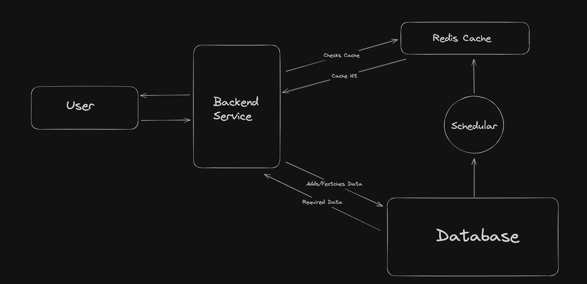

# Url Shortener Backend

A rudimentary URL shortener backend service built primarily for learning and demonstration purposes.

## Running the Application
- Ensure you have [Java 17](https://www.oracle.com/java/technologies/javase/jdk17-archive-downloads.html) or higher  installed.

- Clone the repository 
```
git clone https://github.com/Pal8304/Url-Shortener.git
```

## Architecture

### High Level of Architecture


### Key Components
- **Backend Service**: Handles all the operations, like creation of short url, integrating cache and database.
- **Database**: Stores all the URL related data.
- **Redis Cache**: Improves the fetching/lookup time. 
- **Schedular**: Refreshes the cache by maintaining only top most visited urls, due to memory constraints of cache.

### System Design Considerations


## Features 

- [x] No hash collision url generation 
- [ ] Custom URLs ( User defined short urls )
- [ ] Generate keys on runtime so now predictability
- [ ] Add tests 

## API Endpoints 

- **Generate Shortened Url** : 
```
POST http://localhost:8080/api/
    
Body:
{
   "originalUrl" : "https://github.com/Pal8304/Url-Shortener"
}
```
                  
- **Redirect to Original Url** : ```GET http://localhost:8080/api/{short_url} ```
